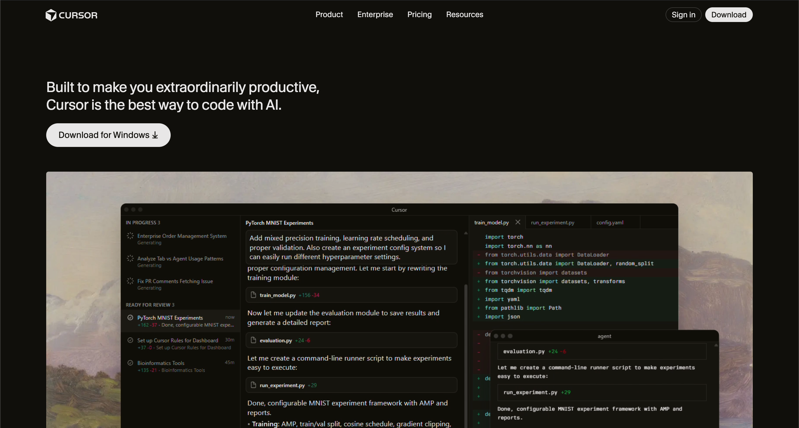

# Dev Tool Landing Page - Cursor (Recreation)
 
**HTML & CSS Assignment**

## Project Overview
This project is a pixel-perfect recreation of the [Cursor.com](https://cursor.com) landing page, focusing on visual fidelity, structural accuracy, and clean code. It is built strictly using **HTML5** and **CSS3**, adhering to the "Desktop-first" design constraint without any frameworks, JavaScript, or TailwindCSS.

*(Note: This is a placeholder for the final full-page screenshot)*

## 🚀 Live Demo
<!-- Add your Vercel/GitHub Pages link here -->
[Link to Live Site](https://cursordotcom.vercel.app)

## 🛠️ Technology Stack
- **HTML5**: Semantic structure (header, main, sections, footer).
- **CSS3**: Custom styling, Flexbox, Grid, CSS Variables.
- **No Frameworks**: Pure vanilla implementation.

## 📝 Sections Recreated
As per the assignment requirements, the following 11 sections have been meticulously built:

1.  **Top Navigation Bar**: Semantic `<nav>`, logo, links, and working CTA buttons.
2.  **Hero Section**: Main headline, description, and large product screenshot.
3.  **Trusted By Section**: Company logos layout.
4.  **Feature Sections**: Three alternating blocks of text and interface previews.
5.  **Feature Cards**: Grid layout highlighting core features.
6.  **Testimonials**: Quote cards from industry leaders.
7.  **Use Cases**: Cards showcasing different models and contexts.
8.  **Changelog**: Chronological list of recent updates.
9.  **Team/About**: Team section with description and "Join us" CTA.
10. **Final CTA**: Prominent "Try Cursor now" section.
11. **Footer**: Comprehensive multi-column footer with links.

## 🎨 Design System
The design closely mirrors the original Cursor brand identity.

### Typography
- **Primary Font**: `Inter` (Sans-serif) for clean, modern readability.
- **Headings**: Bold weights (700/600) for visual hierarchy.
- **Body**: Regular weights (400/500) for content.

### Color Palette
- **Background**: `#000000` (Pure Black) - as requested for visual accuracy.
- **Text Primary**: `#FFFFFF` (White)
- **Text Secondary**: `#A1A1AA` (Light Gray) for descriptions and subtext.
- **Accent**: `#FF6B00` (Orange) for CTA buttons.
- **Borders/Separators**: `rgba(255, 255, 255, 0.1)` for subtle division.

### Layout & Spacing
- **Container**: Fixed width (max 1200px) centered layout.
- **Spacing**: Generous whitespace (80px - 120px) between sections to match the premium feel.
- **Grid/Flex**: Utilized for precise alignment of cards and navigation elements.

## ✅ Assignment Constraints Check
- [x] **Desktop-first design** (Mobile responsiveness not required)
- [x] **HTML & CSS Only** (No JS, No Tailwind)
- [x] **Visual Accuracy** (Matched structure, typography, and colors)
- [x] **Semantic HTML** (Used `<section>`, `<article>`, `<header>`, `<footer>`, etc.)
- [x] **Working Links**: "Sign in" and "Download" buttons are functional.

## 👥 Credits
- **Original Design**: [Cursor.com](https://cursor.com)
- **Logos & Assets**: [Brandfetch](https://brandfetch.com/cursor.com) / Cursor Assets

---

**Built with precision and passion by Pranav.**  
*Crafting pixel-perfect experiences, one line of code at a time.*

[GitHub](https://github.com/pranavgawaii) • [LinkedIn](https://linkedin.com/in/pranavgawai) • [Portfolio](https://pranvx.in)

